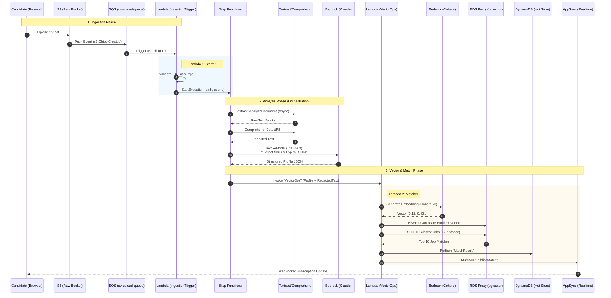
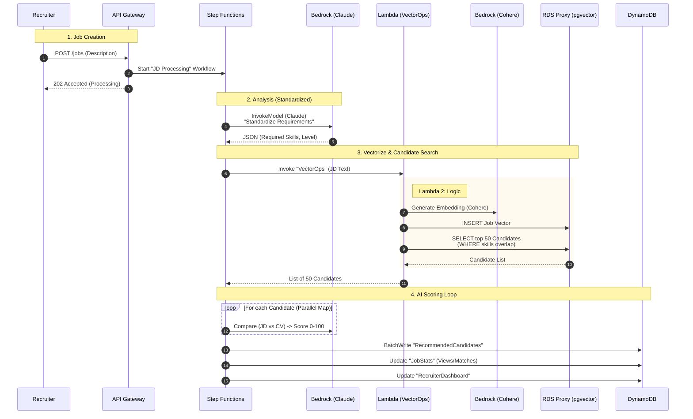
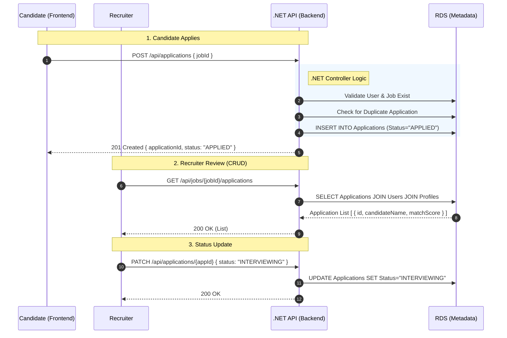
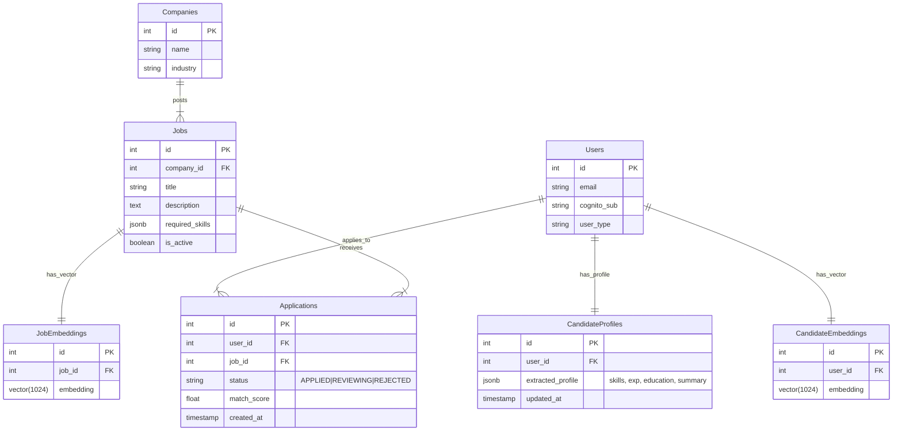

# SmartHire Matching System Architecture

## Overview

This document details the architecture for the **Smart JD Matching System**, enabling real-time, bi-directional matching between Candidates and Jobs using **PostgreSQL (pgvector)** and **AWS Step Functions**.

---

## 1. System Workflows (Sequence Diagrams)

This section consolidates all interaction flows for Candidates, Recruiters, and Application Management.

### A. Candidate Flow (Upload -> Match)



### B. Recruiter Flow (Job Post -> Candidate Rank)



### C. Application Management Flow (.NET Core CRUD)



---

## 2. Data Models & Entity Relationships (ERD)

### A. Unified Database Schema



### B. Data Storage Strategy

#### 1. Raw Assets (Amazon S3)

- **Bucket**: `smarthire-raw-assets`
- **Paths**: `candidates/{userId}/cv.pdf`, `jobs/{jobId}/jd.pdf`
- **Purpose**: Immutable backup and audit trail.

#### 2. Relational & Vector Data (Amazon RDS PostgreSQL)

Serves as the **Source of Truth** for business entities and semantic headers.

- **Tables**: `CandidateProfiles`, `Jobs`, `Applications`.
- **Pgvector**: `CandidateEmbeddings`, `JobEmbeddings`.

#### 3. Hot Store / Cache (Amazon DynamoDB)

- **Table**: `ApplicationTracking` (Single Table Design)
- **Purpose**: High-frequency read/write operations for realtime UI updates (e.g., dashboard stats).

---

## 3. Component Details & Payload Logic

To decouple ingestion from heavy processing, we use **SQS** as a buffer and **Step Functions** for orchestration.

### A. SQS Queue (`cv-upload-queue`)

- **Trigger**: S3 Event Notification (`s3:ObjectCreated:Put`).
- **Payload**: Standard S3 Event JSON.

### B. Lambda 1: `IngestionTrigger` (The "Starter")

- **Responsibility**: Validates file, Starts Step Function.

### C. Step Functions Orchestration

1.  **Textract**: Reads PDF.
2.  **Comprehend**: Detects PII.
3.  **Bedrock (Claude)**: Extracts structured JSON.

### D. Lambda 2: `VectorOps` (The "Matcher")

- **Responsibility**: Embeds text (Cohere), updates RDS (pgvector), syncs to DynamoDB.

---

## 4. Hybrid Architecture Strategy

### A. The "Split Brain" Design (Net vs Python)

| Feature         | Technology Stack        | Responsibility                                 | Type                        |
| :-------------- | :---------------------- | :--------------------------------------------- | :-------------------------- |
| **User/Auth**   | .NET 8 Lambda + Cognito | Auth, Profiles, Job CRUD, Application Tracking | Synchronous (API GW)        |
| **File Upload** | AWS S3 Signed URLs      | Secure direct-to-bucket transfers              | Synchronous (Client <-> S3) |
| **AI/Vector**   | Python + Step Functions | Parsing, Embedding, Vector Search              | Asynchronous (Event-Driven) |

### B. API Contracts (CRUD)

**1. Create Application**
`POST /api/applications`

```json
{ "jobId": 102, "notes": "..." }
```

**2. Get Job Applications**
`GET /api/jobs/102/applications`

---

## 5. Infrastructure Migration Plan (IaC)

### A. What to **DELETE** (Refactor)

- `iac/lambda/cv_parser/cv_parser.py`
- `iac/lambda/jd_parser/jd_parser.py`

### B. What to **ADD** (New Resources)

- **SQS Queues**: `iac/modules/queue`
- **Step Functions**: `iac/modules/processing`
- **Lambda (Ingest & VectorOps)**
- **RDS Proxy**
- **AppSync**
- **X-Ray**: Service instrumentation and permissions.

### C. Terraform Variable Changes

---

## 6. Observability & Monitoring (AWS X-Ray)

To ensure visibility into the CV/JD processing pipeline, we will implement **AWS X-Ray** for end-to-end tracing of the asynchronous AI workflows.

### A. Tracing Scope

X-Ray instrumentation applies **only** to the CV/JD processing flows (Candidate Flow and Recruiter Flow):

1.  **Lambda 1 (IngestionTrigger)**: Trace file validation and Step Function invocation.
2.  **Step Functions Workflow**: Visualize orchestration path (Textract → Comprehend → Bedrock → VectorOps).
3.  **Lambda 2 (VectorOps)**: Trace embedding generation, RDS writes, and DynamoDB updates.
4.  **Downstream Services**: Capture sub-segments for Textract, Bedrock, RDS, and DynamoDB calls.

### B. Key Metrics to Monitor

- **End-to-End Latency**: Time from CV upload to embedding completion and DynamoDB sync.
- **Error Rates**: Failures in Textract, Bedrock throttling, or database timeouts.
- **Service Dependencies**: Visualize how Lambdas, Step Functions, and AI services interact.
- **Cold Starts**: Lambda initialization impact on ingestion throughput.

### C. Implementation Details

- **IAM Permissions**: Add `xray:PutTraceSegments` and `xray:PutTelemetryRecords` to Lambda execution roles.
- **Environment Variables**: Set `AWS_XRAY_CONTEXT_MISSING` to `LOG_ERROR` to prevent trace errors.
- **Sampling Rules**: Configure rules in X-Ray console (e.g., 100% sampling for errors, 10% for successful CV parses).

- `textract_enabled`
- `bedrock_model_id`
- `rds_proxy_endpoint`

```

```
